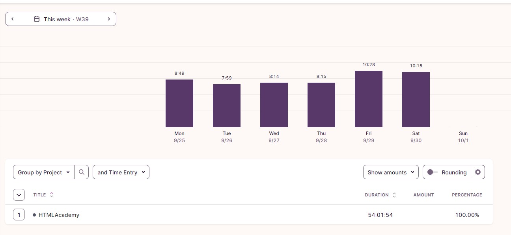

## Использование CLI:

1. Запустить сервер: npm run mock:server
2. Генерация данных БД: npm run ts ./src/main.cli.ts -- --generate 100 admin test localhost 27017 guitar-shop secret

## Запустить сервер backend API: npm run start:dev

## Затрачено времени:

## Переменные окружения:

PORT=3010 - порт сервера API
SALT=secret - настройка "соли" для базы данных
DB_HOST=127.0.0.1 - адрес базы данных
DB_PORT=27017 - порт БД
DB_USER=admin - логин админа БД
DB_PASSWORD=test - пароль админа БД
DB_NAME=guitar-shop - название БД
UPLOAD_DIRECTORY=upload - директория загрузки фото товаров
STATIC_DIRECTORY_PATH=static - директория статичных фото
JWT_SECRET=dkslsladfieadaiid - секрет для JWT токена
HOST=localhost адрес сервера API

### Бек сделал полностью, фронт проходил 7 месяцев назад, много забылось и было очень много затупов. Вот и сейчас: получалось авторизоваться, и что то сломал похоже - не работает. 7 дней для бека и фронта очень мало для меня. Спасибо.
